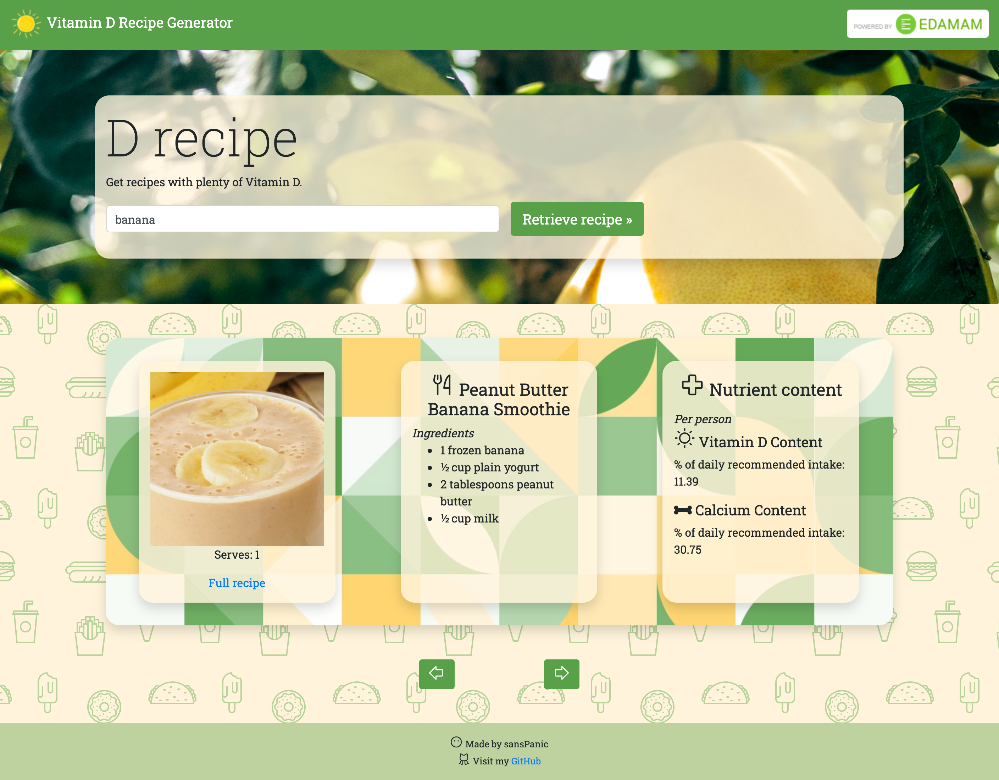
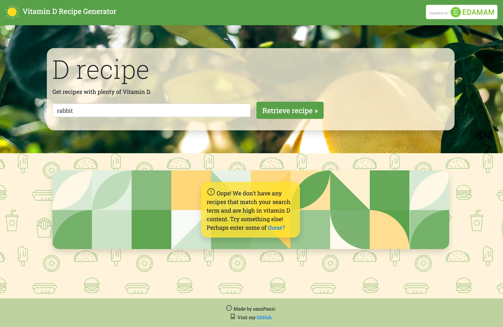

# VITAMIN D RECIPE GENERATOR

### :leafy_green: Recipe retrieval of high vitamin-D foods based on search-term

This is a small personal project, intended for practice only.

### :lemon: Features: 

* Retrieval of recipe from API based on search-term
* Filtering of recipes based on vitamind D content per person (vitamind D > 10% of daily recommended dose)
* Pagination (first attempt)
* Error handling: no matches/no matches with high enough vit D content/invalid submission

### :pizza: Concepts practiced: 

1. Vanilla JS DOM Manipulation
2. API calls with Axios
3. Reading & understanding external API documentation
4. Bootstrap
5. Error handling
6. Pagination

# SCREENSHOTS

# Credits 

1. Icons by [phosphor](https://phosphoricons.com/)
2. Background by [HeroPatterns](https://www.heropatterns.com/)
3. Patterns by [Patternpad](https://patternpad.com/)
4. API powered by [Edamam](https://www.edamam.com/)